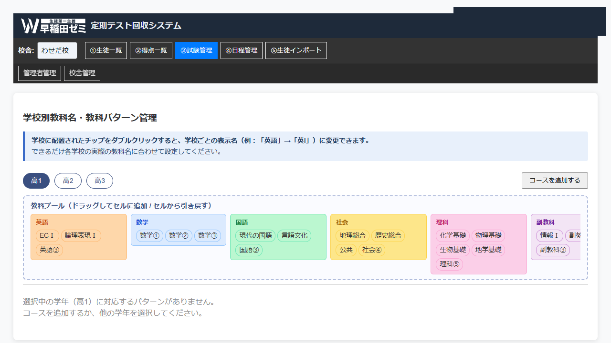
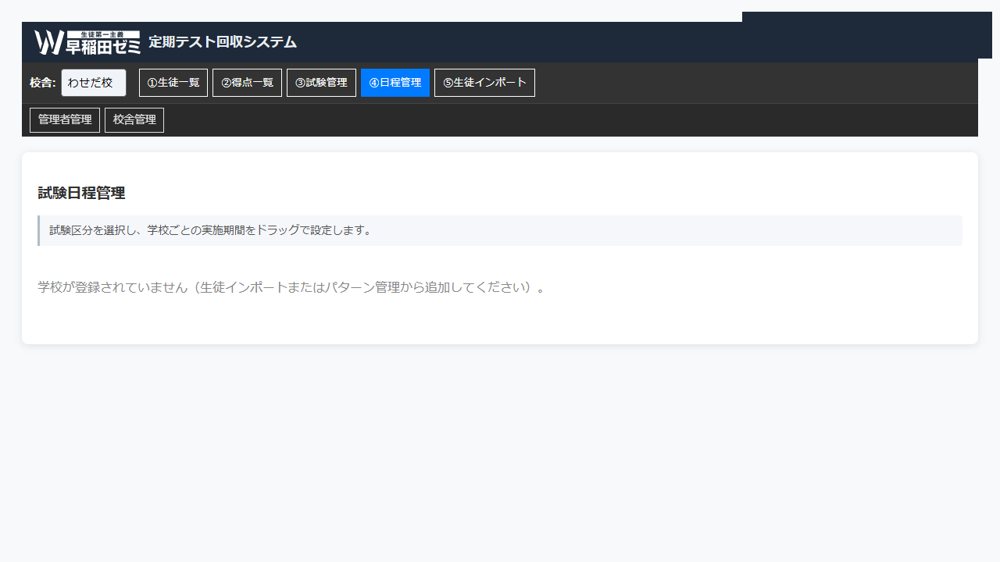

# 定期テスト回収システム 取り扱い説明書

塾生の定期試験の得点・順位を管理するシステムです。

---

## 概要

| 役割 | アクセス方法 | 主な操作 |
|------|------------|--------|
| **生徒** | LINE アプリ（LIFF） | 得点・順位の入力 |
| **管理者** | Web ブラウザ（Google ログイン） | 生徒・試験・得点の管理 |

**技術構成**
- バックエンド：Google Apps Script (GAS)
- データ：Google スプレッドシート（本部 SS + 校舎別 SS）
- 生徒向け：LINE LIFF
- 管理者向け：GAS Web アプリ

---

## ユーザー画面（LINE）

生徒は LINE アプリから得点を入力します。

> ※ スクリーンショットは LINE アプリ内からキャプチャして差し替えてください。

### 得点入力

1. 試験区分（1学期中間・前期中間 など）をドロップダウンで選択
2. 表示された教科一覧に **点数・学年順位・クラス順位** を入力
3. 受験しなかった教科は **欠試** にチェック
4. 「保存する」ボタンで送信 → トースト通知で完了確認

### 教科の編集（✎ ボタン）

各行の編集ボタンを押すと教科の変更ができます。

- ドロップダウンで受験する教科を追加・変更
- 削除ボタンで教科を取り除く
- **「その他（名称を入力）」** を選ぶと、未登録の教科を仮登録できます（管理者が後から正式登録）

### 初回設定

未設定の生徒が初めてアクセスすると設定画面が表示されます。

| 状況 | 表示される画面 |
|------|-------------|
| コース未設定 | 学校・コースの選択 |
| 文理未設定（高2・高3） | 文系 / 理系の選択 |

---

## 管理画面

ブラウザで GAS の URL にアクセスし、Google アカウントでログインします。



**最初に画面上部の「校舎」プルダウンで操作対象の校舎を選択してください。**  
校舎を選択するとデータが読み込まれます。

---

### ① 生徒一覧

生徒のコース・文理を管理します。

- 学校・学年・コース・文理のチップでフィルタリング
- 生徒を複数選択して **コース** や **文理** を一括変更できます
- コース追加時は教科パターンが自動生成されます

---

### ② 得点一覧

生徒と教科のクロス表で入力済み得点を確認します。

- スライサーチップで学校・学年・コース・文理を絞り込み
- 生徒が「その他」で入力した **仮教科** をインラインで表示
  - 「新規登録」→ 正式な教科として登録
  - 「既存統合」→ すでにある教科へ紐づけ

---

### ③ 試験管理（教科パターン）

学校・コース・学年・文理ごとに、生徒が入力できる **教科の一覧** を設定します。

- 教科プールからチップをドラッグして各セルに追加
- セルのチップをダブルクリックすると **学校別の表示名** を変更できます（例：「英語」→「英Ⅰ(理)」）
- 「コースを追加する」ボタンで新しいコース・学年の組み合わせを登録

---

### ④ 日程管理



試験の実施期間を登録します。

- 試験区分（1学期中間・期末 など）× 学校ごとに期間を設定
- **日程を保存すると生徒が LIFF から得点を入力できるようになります**
- 試験区分は複数の学校で共有することも可能

---

### ⑤ 生徒インポート

Excel（.xlsx）ファイルで生徒情報を一括登録します。

1. 「ファイルを選択」で Excel ファイルをアップロード
2. 内容を確認して「インポート実行」
3. 同じ生徒 ID がある場合は上書き更新（upsert）

---

### 管理者管理

管理者アカウントを追加・編集・無効化します。

| ロール | 操作できる範囲 |
|--------|-------------|
| **master** | 全校舎 + 管理者ユーザーの管理 |
| **branch_admin** | 担当校舎のみ |

---

### 校舎管理

校舎の追加と子スプレッドシートの作成を行います。

1. 「校舎を追加」で校舎名・cram_id を登録
2. 「子 SS 作成」ボタンで校舎専用のスプレッドシートを自動生成
3. 「共有設定」で該当校舎の branch_admin に自動共有

---

## 初回セットアップの流れ

新しい校舎を運用開始する際の手順です。

```
1. 校舎管理       … 校舎を追加し、子 SS を作成・共有
2. 生徒インポート … Excel で生徒を一括登録
3. ③ 試験管理    … コースごとに受験教科を設定
4. ④ 日程管理    … 試験の実施期間を登録
      ↓
   生徒が LINE から得点を入力
      ↓
5. ② 得点一覧    … 入力された得点を確認・仮教科の紐づけ
```
